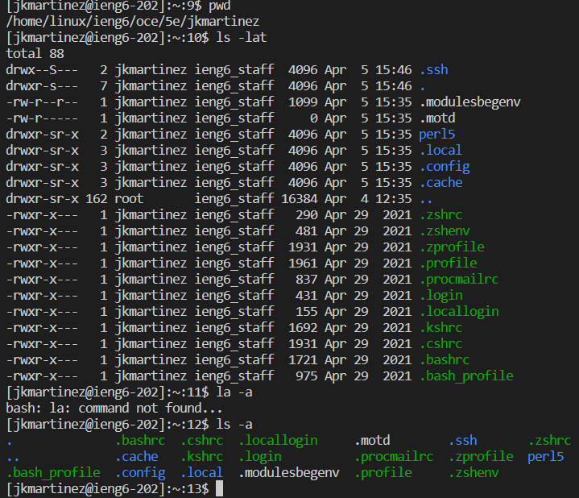

# Lab report 1
1) First we download VScode from this link: [Link](https://code.visualstudio.com/). Once downloaded we sign in and it should look like this: 
	
---
2) Now, we can connect remotely. To do this we click "terminal" at the top, then "new terminal", and then we type in the command "$ ssh cs15lsp23zz@ieng6.ucsd.edu" where "zz" is replaced by the last 2 letters of the student account.
Once it's ran it should look like this: 
	
---
3)Finally, we can try to run some commands such as:
* cd ~
* cd
* ls -lat
* ls -a
* ls <directory> where <directory> is /home/linux/ieng6/cs15lwi23/cs15lwi23abc, where the abc is one of the other group members’ username
* cp /home/linux/ieng6/cs15lwi23/public/hello.txt ~/
* cat /home/linux/ieng6/cs15lwi23/public/hello.txt. 
It should look like this: 
  
